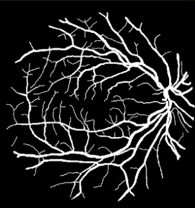
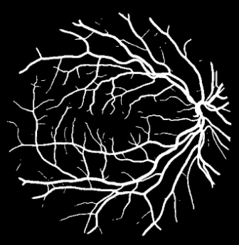

# Final-Year-Thesis-Retinal-Vessel-Segmentation-
This project is based on my final year thesis i.e. Retinal Vessel Segmentation using pytorch framework. This repository includes dataset preparation, data processing, training, testing, and visualization.

  


  
        Retinal Image              Ground Truth Segmentation          Predicted Segmentation Mask

## Table of Content
1. [Introduction](#introduction)
2. [Requirements](#requirements)
3. [Dataset Preparation](#dataset)
4. [Configuration](#config)
5. [Model Architecture](#model)
6. [Training](#training)
7. [Testing](#testing)
8. [Visualization](#visualization)
9. [Performance Metrics](#performance)
10. [Conclusion](#conclusion)

## 1. Introduction: <a name="introduction"></a>

## 2. Requirements: <a name="requirements"></a>
It is highly recommended to first try using your current python environment. However, the following environment is successfully able to run the code.

```
Libraries                 Version

1.  python                 >= 3.5
2.  torch                  1.8.1
3.  torchvision            0.9.1
4.  cudnn
5.  tensorboardX           2.2
6.  argparse               1.1
7.  pandas                 1.1.5
8.  matplotlib             3.2.2
9.  opencv                 4.1.2
10. numpy                  1.19.5
```


## 3. Dataset Preparation: <a name="dataset"></a>
* A total of 5 different publicly available retinal image datasets were used for experimentation purpose. Please download the datasets from the following official address: [DRIVE](https://drive.grand-challenge.org/), [STARE]( https://cecas.clemson.edu/~ahoover/stare/), [CHASE_DB1]( https://blogs.kingston.ac.uk/retinal/chasedb1/), [DIARET_DB1](http://www.it.lut.fi/project/imageret/diaretdb1/), [HRF]( https://www5.cs.fau.de/research/data/fundus-images/). These datasets consist of the retinal images, its manual segmentation, mask. We also used some proprietary dataset.

## 4. Configuration: <a name="config"></a>

## 5. Model Architecture: <a name="model"></a>

## 6. Training: <a name="training"></a>
* Update the config.py file according to your requirement and then run train.py file. 


## 7. Testing: <a name="testing"></a>

## 8. Visualization: <a name="visualization"></a>

## 9. Performance Metrics: <a name="performance"></a>

## 10. Conclusion: <a name="conclusion"></a>
